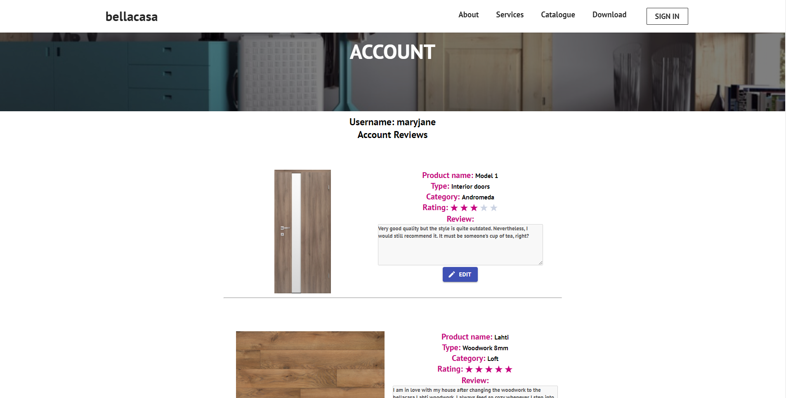
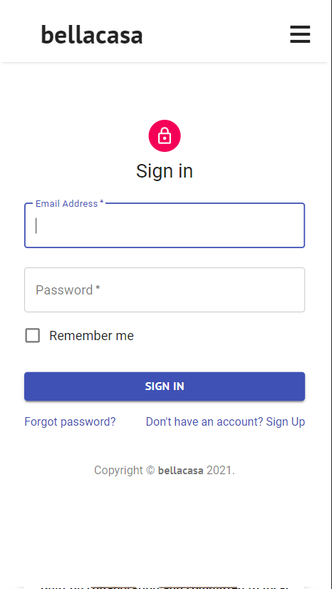

# Bellacasa-Final-Year-Project
 A data displaying web application developed using React.js, MaterialUI, Node.js, Redux, Express.js, PostgreSQL 
 - Responsive and modern design including hamburger navbar
- implemented social media sticky buttons on homepage
- implementation of the google maps API
- about page and services page are static pages for presentation purposes that use flexbox to make the responsive
- download page displays two downloadable catalogue pdfs
- authentification system implemented with redux that connects to the backend
- user is redirected once logged in
- logged in session ends when user clicks the 'log out' button
- option to either log in or sign up
- catalogue not yet implemented (uses props)
Screenshots: 

